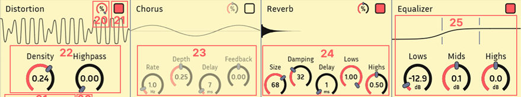

# Just a Sample v1.2

This page acts as a tutorial for Just a Sample, and also documents some hidden features and use-cases.

JAS is shorthand for Just a Sample.

### Contents

- [Plugin Interface](#plugin-interface)
    - [Playback Controls](#playback-controls)
    - [Editor and Navigator](#editor-and-navigator)
    - [Effects](#effects)
    - [Footer](#footer)
- [Other Features](#other-features)

- [Tips and Tricks](#tips-and-tricks)

## Plugin Interface


### Playback Controls


After loading a sound into Just a Sample, the header is the first place to find key playback controls. 

Drag vertically over controls to change their values smoothly. You can also double-click on text to edit with precision.

Most controls can be automated smoothly.

1. Tune the pitch of your sound with the **semitone control** (-12 to +12) and finetune with the **cent control** (-100 to +100).

2. **EXPERIMENTAL**: This control opens a dialog to select a region of your sample. JAS will analyze the pitch of the selected region and automatically set the semitone and cent controls, such that the center A plays at 440hz. This works best on simple sound sources.

<p align="center"></p>

3. The **attack envelope** controls the volume of your instrument when a note is first activated. You have fine control over the attack length and shape. You should use a short attack time for quicker sounds and a longer attack time for more drawn out sounds. The default value is 1ms, but most sounds will use >20ms for a more natural feel.

4. The **release envelope** controls the volume of your instrument when a note is released. The envelope will trigger automatically when your note nears the end of the sample.

5. In Basic playback, **Lo-Fi** disables anti-aliasing, resulting in a grittier, retro sound.

6. JAS supports two modes of playback. 

    - In **Basic playback**, sounds are resampled to different pitches by changing their speed. This maintains the quality of the sound but makes it difficult to deal with notes far from center.
    - In **Bungee playback**, sounds are resampled with a complex algorithm to preserve time. This takes very high CPU, but expands the range of functional notes and gives more control over timing. Distortion becomes more noticeable 2-3 octaves from center. Note that resampling to a higher pitch takes more CPU.

7. In Bungee playback, change **playback speed** freely (0.01x to 5x) without affecting pitch. 

8. **Looping** wraps the end of a sound back to its start, allowing you to hold out a note indefinitely. When looping is enabled, JAS allows for separate control of a **sample start** and **sample end** portion. Playback occurs as follows.

    - Begin playback at sample start.
    - At loop end, wrap back around to loop start.
    - When the note is released, jump to the start of the sample end portion, and fully continue playback until sample end.

    JAS uses a power-preserving crossfade to handle these transitions. The crossfade length can be controlled via plugin parameter *Crossfade Samples*.

9. **Mono** mixes the plugin output to mono, averaging the channels. This is reflected visually in the waveform views. 

10. The **gain control** scales the plugin's output volume.

### Editor and Navigator


Through the **editor** and **navigator** views (top and bottom waveform), JAS enables modern, powerful navigation. Enjoy beautiful, fast rendering. These views also display active voices.

The editor allows you to visualize your waveform and adjust the sample playback bounds. Use your mousewheel or trackpad to intuitively zoom in/out and move the editor view around the loaded sample. Modifier keys adjust the response. 

11. Freely move **sample bounds**.

12. Freely move **loop bounds**.

JAS enables sample-level precision. Seamlessly zoom in to the level of individual samples. 

At a high zoom level, JAS will display channels separately. For visual clarity, only a single channel will have full opacity. This is purely visual, and you can select which channel is focused by clicking on the waveform.

<p align="center"></p>

JAS includes a *special* feature when the sample bounds go below a small threshold. **Waveform Mode** loops your sample bounds like a wavetable synth. Combined with the effects chain, this feature turns JAS into a unique and surprisinly versatile synthesizer. It also comes with separate tuning parameters. I have lots of fun with this, exploring the sound of different waveforms.

<p align="center"></p>

13. JAS pairs the editor with the **navigator**, which acts as a "scrollbar" of sorts for your waveform. Use your mouse to quickly move around and resize the view. The navigator also reacts to scroll gestures like the editor. Double-click to reset the view.

14. The **file selector** stores a history of loaded files and lets you load a sample directly from your file explorer.

15. For convenience, JAS automatically stores small samples in plugin state. That means no more dealing with missing files! Your sampler presets will work forever, even if you lose track of your samples. You may disable this functionality with the **file link** toggle. This feature is also disabled for larger files. 

16. The **play** button lets you listen to your work without leaving the plugin. It doubles as a **halt** button whenever voices are active. 

17. For convenience, JAS allows direct **recording** into the plugin. Configure your audio inputs with the little mic icon.

<p align="center"></p>

18. **Fit** the editor view to your sample bounds.

19. **Pin** the sample bounds to the editor view. This control fixes the sample bounds to their current locations on screen, maintaining their place as you move or zoom the bounds. This is convenient when you want to easily explore a large sample without moving your sample bounds manually. 

### Effects 



The **effects** chain lets you fine-tune your sound without leaving the plugin interface. JAS provides four effect modules, which can be freely reordered.

20. **Mix** between the unprocessed and processed sound (input and output respectively).

21. **Enable** an effect before you start using it, or quickly disable it.

22. **Distortion** can add subtle warmth, heavy grit, or completely warp your sound. **Density** controls the intensity of the changes. **Highpass** removes lower tones from your sound.

23. **Chorus** simulates the sound of multiple voices playing in unison, creating a thicker, more spacious sound. **Rate** controls the speed of movement. **Depth** sets the intensity of pitch variation. **Delay** determines the base delay time. **Feedback** feeds a portion of the processed signal back into the input. Higher feedback levels produce unexpected sounds.

24. **Reverb** adds space and echo, simulating different environments. Control the virtual **size** and **damping** of your space. **Delay** the effects of the reverb to create an echo effect. Control the **lows** and **highs** of the reflections to simulate different surfaces. 

25. The **equalizer** allows you to modify the tone of your sound by adjusting different frequency bands. You can boost or cut the **lows**, **mids**, and **highs** of your sound to shape the overall character—whether you're removing muddiness, adding presence, or brightening the top end. Change the cutoffs by moving the vertical bars with your mouse.

### Footer


The footer contains some additional, non-essential plugin controls.

26. **Show** or **hide** the FX chain. JAS hides the effect chain by default for better visual clarity.

27. **Pre-FX** applies the FX chain before the attack and release envelopes. This can be useful in mimicking the effect of "bouncing" your effects.

28. The **help text** is context aware, providing basic info wherever your mouse is located. This includes the values of controls.

29. **Dark mode** can reduce eye strain.

<p align="center"></p>

30. **More help** opens this page :\)

31. The **logo** shows the plugin's version number in the help text and opens the main GitHub page.


## Other Features
Some useful features are not visualized in the UI.

- JAS supports **pitch wheel** events, allowing you to smoothly modulate from -1 to +1 semitones.

- Drag the bottom right corner to freely **resize** the plugin.

- JAS has special support for Reaper! 

    - The *UI Update* parameter triggers Reaper to save plugin state on non-parameter changes, allowing you to undo/redo every interaction. 

    - Load a file in JAS using ReaScript (no Mac support):
        ```lua
        reaper.GetSetMediaTrackInfo_String(track, "P_EXT:FILE", filePath, true)
        ```

- JAS has some extra parameters.

    - *Voice Count* allows you to change the maximum number of voices (notes playing at once). This is set to 256 by default but can be lowered to handle CPU limitations. 

    - *MIDI Range Start* and *MIDI Range End* controls the interval of notes that JAS accepts. This is useful if you want to insert multiple plugin instances on the same track to handle different intervals.

    - *Crossfade Samples* controls the amount of crossfade applied when looping. 

    - *Octave Speed Factor* stretches out the usable range of Bungee mode by changing the playback speed. This is somewhat like a hybrid control between Basic and Bungee.

## Tips and Tricks

- In **Bungee** mode, lower **playback speed** to a value less than 0.1x, and add some effects. This can create amazing pads!

- Zoom in to **Waveform Mode** and **pin** your sample bounds to easily explore your waveform. Move your bounds around with a touchpad as you play to see how the sound morphs.

- Set **Voice Count** to 1 to play JAS like a mono synth.

- Turn on **Pre-FX** and enable **reverb**. Then increase **size** and decrease **damping** to maximize the effects of the reverb. Notice how **Pre-FX** smoothly cuts off the reverb when you release notes.

- Try to have fun! Your tools are only as good as your creative potential.
