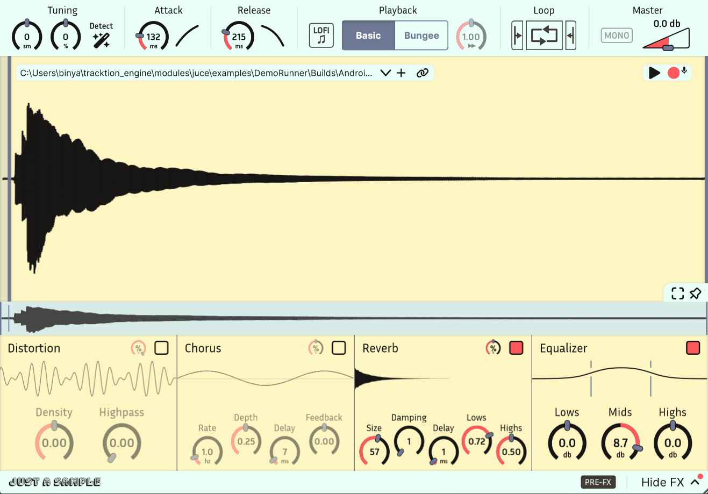

# Just a Sample

[Your favorite sampler shouldn't be complicated.](https://bobona.github.io/just-a-sample/)

[See releases](https://github.com/BOBONA/Just-a-Sample/releases)

Available for Windows and Mac in VST3/AU.

## Overview
Just a Sample is a powerful, _modern_ audio sampler, with a focus on simplicity and ease of use. 
Best of all, it's **free** and **open-source**! I spent a lot of time on this project, and I think it will
be a great addition to your plugin collection. 

Feel free to take a look at the source code and reach out with any questions or suggestions. I took care
to make the code as clean and readable as possible, with a focus on good design practices. That being said, 
I am still new to audio programming.

## Features
#### Core features
- Smoothly zoom in to the level of individual samples to 
set bounds as accurately as you need. Waveform drawing is **optimized** for large samples.
- Integrated [Bungee time stretcher](https://github.com/kupix/bungee) allows for
freely modulating time and pitch independently. Try extreme slow-downs (0.01x) for unique sounds.
- Modern navigation controls allow for easy browsing of waveforms with touchpad or mouse.
- A routable FX chain includes reverb, chorus, distortion, and EQ for easy sound design.
- Waveform Mode activates when small bounds are set, looping the waveform periodically like a wavetable synth. This turns Just a Sample into a unique tone generator.
- Easily modify attack and release curves.
- Includes equal power cross-fade looping with separate attack and release sample portions.
- Supports pitch bend and fine-tuning.

#### Extras
- Disable antialiasing for a gritty LoFi effect.
- Record samples directly into the sampler.
- Store samples directly in plugin state to remove dependencies (can be disabled).
- Auto-tune to A440 (experimental, works best on simple sounds).

## Installation
### Pre-built 

You can download installers from,
- [itch.io](https://binyaminf.itch.io/just-a-sample)
- [GitHub Releases](https://github.com/BOBONA/Just-a-Sample/releases)

### Build from source
1. Clone the repository, including submodules.
2. Download additional dependencies (see below).
3. Open the Projucer and make sure all paths are correct. This includes the main project settings,
the exporter settings (external libraries to link), and the individual build settings (header search paths).
4. Good luck! Feel free to open an issue if you run into any problems.

#### Dependencies
Please note that I've linked specific versions. Clone newer versions at your own risk.
- [JUCE](https://github.com/juce-framework/JUCE/tree/51d11a2be6d5c97ccf12b4e5e827006e19f0555a)
- [Bungee](https://github.com/kupix/bungee/tree/0083f748ab2f30ed5969a67602ee66582bd828ae)
- [Melatonin Blur](https://github.com/sudara/melatonin_blur/tree/e7c3d1521958d62ed79a97f4eb2a974b2b25bb0d)
- [Melatonin Inspector](https://github.com/sudara/melatonin_inspector/tree/d0e42b81bb7b747b0b7b51a993366a1f46ea3a55) (for Debug builds)
- [LEAF](https://github.com/spiricom/LEAF/tree/8d86c4e96ac48740da34f24c9f995bc3c4b3b2a0) (for auto-tuning feature)

## Credits
This is my first audio plugin, and I am very happy at how it turned out! This was a long-running project
that took place over the course of over a year (with long breaks), and I learned a lot on the way.

Special thanks to JUCE and The Audio Programmer community for all the help.

Besides the dependencies listed above, this project also benefits from,

- [Gin](https://github.com/FigBug/Gin) (specifically the AirWindows distortion and SimpleVerb)
- [readerwriterqueue](https://github.com/cameron314/readerwriterqueue)
